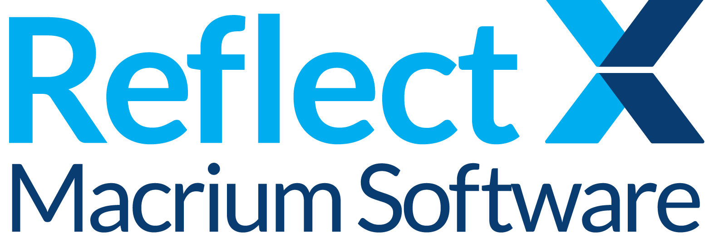

# Macrium Reflect Backup File Format Implementation and Tools

## About Macrium Software

Macrium Software is a leading provider of backup and disaster recovery solutions. Their mission is to provide reliable, efficient, and user-friendly tools that protect your data and ensure business continuity.

## Overview

This repository contains a reference implementation for working with Macrium Reflect backup files (.mrimgx and .mrbakx). It provides practical tools and examples for accessing and processing Macrium Reflect backup files, ensuring data accessibility and independence.

This project complements the official [Macrium Reflect File Layout Documentation](https://github.com/macrium/mrimgx_file_layout), which contains the complete file format specifications and documentation.

## What's Included

### Extract-to-IMG Tool
A practical implementation that demonstrates how to:
- Read and parse Macrium Reflect backup files.
- Extract data from backup images.
- Convert backup formats.
- Handle both Windows and Linux environments.
- Process both full and incremental backups.
- Work with encrypted backup files.

### Technical Implementation
- Bazel build system configuration with reproducible builds.
- Core libraries for file format handling and data extraction.
- Example implementations with test cases.
- Test backup files for verification and development.
- Cross-platform support libraries.
- Command-line interface for batch processing.

## Purpose

This repository serves as a practical reference for:
- Understanding how to work with Macrium Reflect backup files.
- Ensuring data accessibility independent of commercial tools.
- Providing a foundation for cross-platform backup handling.
- Demonstrating real-world implementation of the file format specifications.
- Enabling data recovery in scenarios where commercial tools are unavailable.

## Getting Started

1. Clone this repository.
2. Review the implementation in the `contrib/extract-to-img` directory.
3. Build using Bazel (see the WORKSPACE and MODULE.bazel files).
4. Test with the provided backup files in the Backup-Files directory.

## Technical Details

- **Build System**: Bazel for consistent builds across platforms.
- **Core Components**: 
  - File format parsing libraries.
  - Data extraction utilities.
  - Cross-platform support.
  - Encryption handling.
  - Backup chain processing.
- **Dependencies**: Managed through Bazel for reliable builds.

## Support

For technical questions and support:
- Visit the [Community Forums](https://forum.macrium.com).
- Check the [Main Documentation Repository](https://github.com/macrium/mrimgx_file_layout).
- Contact the [Support Team](https://www.macrium.com/contact).
